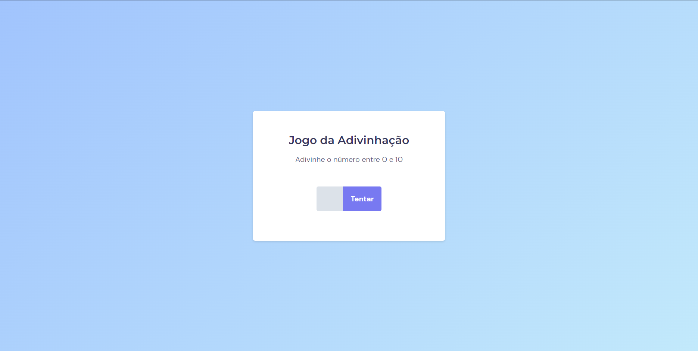

# Jogo da Adivinhação
Jogo feito no curso Explorer da Rocketseat pra treinar conceitos de javascript.

## Tecnologias usadas:
- HTML  
- CSS  
- JavaScript  
- Git

## Layout
Esse projeto foi feito a partir [desse](<https://www.figma.com/file/5pZNHokTKTvld18xVAbk5C/Jogo-Adivinha%C3%A7%C3%A3o/duplicate?type=design&node-id=0-1&mode=design>) layout do figma.
 
